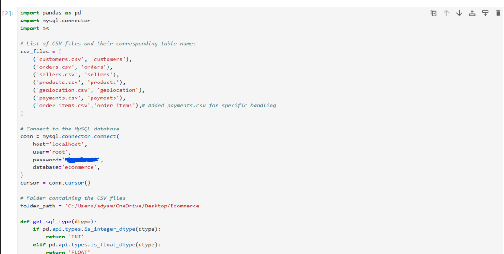
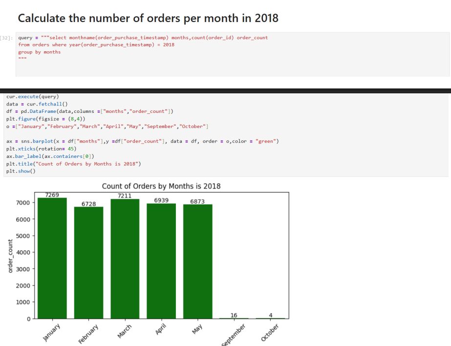
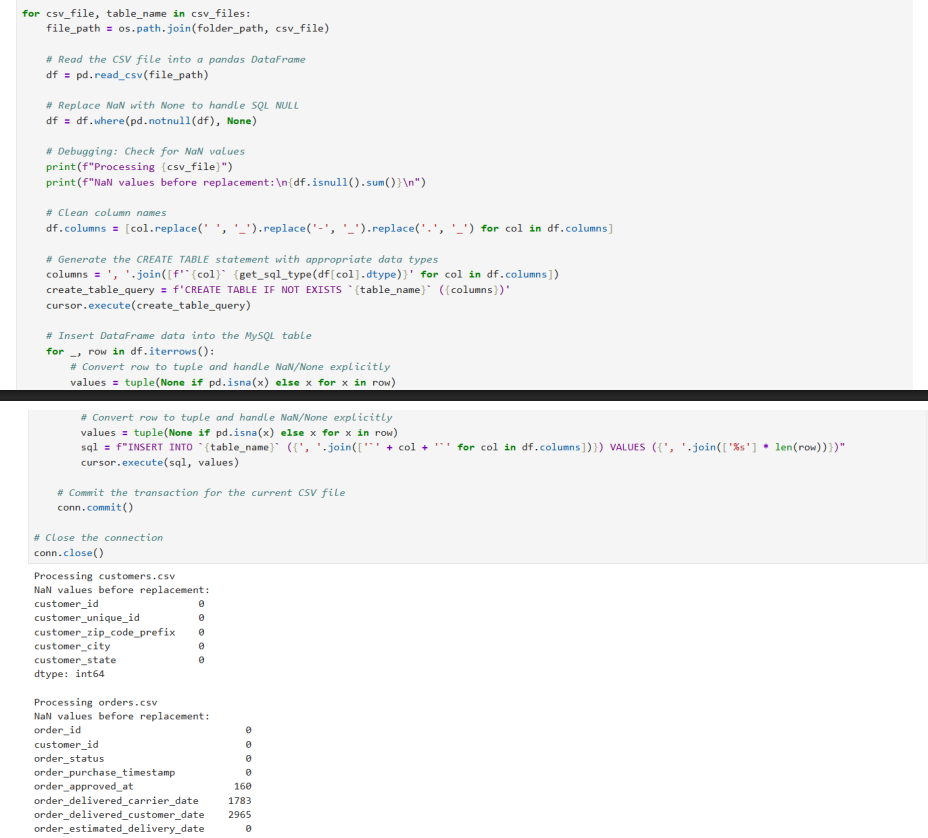

# Ecommerce Project (Python + SQL)

An Ecommerce Management System developed using Python and SQL for handling product management, customer details, and database operations efficiently.

---

## Project Overview

This project demonstrates the implementation of an ecommerce system using Python connected with an SQL database. The system allows users to manage products, store records, and perform database operations through a simple interface.

---

## Features

- User Login System
- Product Management
- Customer Record Handling
- Database Connectivity
- Data Storage using SQL
- Easy-to-use Interface
- CRUD Operations (Create, Read, Update, Delete)

---

## Technologies Used

- Python
- SQL
- MySQL / SQLite
- Tkinter (GUI)

---

## Project Structure

```text
Ecommerce-Python-SQL/
│
├── Ecommerce(Python+SQL).pdf
├── screenshots/
│   ├── Login.png
│   ├── Insights.png
│   └── DataBase.png
│
└── README.md
```

---

## Screenshots

### Login Page


---

### Insights Page


---

### Database


---

## How to Run the Project

1. Install Python on your system
2. Install required libraries
3. Configure the SQL database
4. Run the Python file

```bash
python main.py
```

---

## Objectives of the Project

- To understand Python programming
- To learn SQL database connectivity
- To perform database operations using Python
- To develop a basic ecommerce management system

---

## Future Improvements

- Online payment integration
- Advanced UI design
- Admin dashboard
- Product search and filters
- User authentication enhancements

---

## Author

Aadya

---

## License

This project is for educational purposes only.
